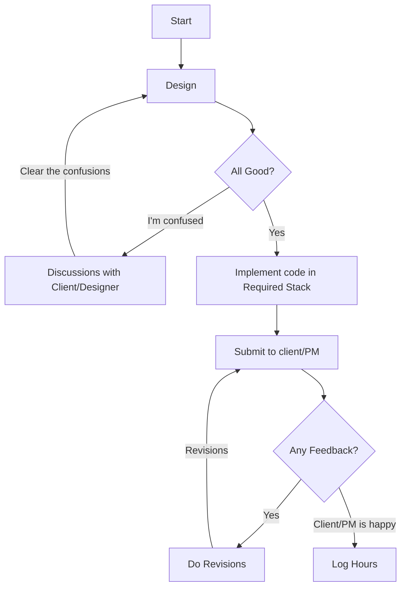

# Umair Qazi

```mermaid
flowchart TD
    A[Start] --> B[Design]
    B --> C{All Good?}
    C --> |I'm confused| D[Discussions with Client/Designer]
    D --> |Clear the confusions| B
    C --> |Yes| E[Implement code in Required Stack]
    E --> F[Submit to client/PM]
    F --> G{Any Feedback?}
    G --> |Yes| H[Do Revisions]
    H --> |Revisions | F
    G --> |Client/PM is happy| I[Log Hours]
```
